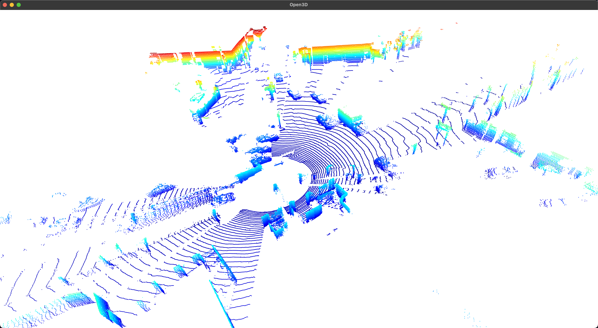

# Evaluation

Before start training, please make sure you have prepared the dataset listed [here](./INSTALL.md/#table-of-contents).

```python
python eval.py -dc path_to_data_config -ec path_to_exp_config -m path_to_ckpt_model

# examples:
# evaluation on KITTI360 static scene
python eval.py \
    -dc configs/kitti360/static/3.yaml \
    -ec configs/exp.yaml \
    --model output/scene_kd3/models/model_it_25000.pth \
    --unet output/scene_kd3/models/unet.pth \
    --type test \
    --save_eval \
    --save_image \
    --save_pcd
```

<a id="eval-args"></a>
<details>
  <summary><span style="font-weight: bold;">🔍 Click here to see the detailed Command Line Arguments for evaluation.</span></summary>
  <hr>

#### -dc, --data_config_path
Data configuration file (required).
#### -ec, --exp_config_path
Experiment configuration file (required).
#### -m, --model
Path to load checkpoint model (optional). If not speicified, initial model would be used for evaluation.
#### -un, --unet
Path to load U-Net model for refined ray drop (optional). If not be specified, ray drop would not be refine.
#### -t, --type
Dataset split type for evaluation, set `train/test/all`.
#### -e, --save_eval
Whether to save evaluate metrics (optional).
#### -i, --save_image
Whether to save evaluate images (optional).
#### -p, --save_pcd
Whether to save point cloud (optional).
#### -u, --use_gt_mask
Whether to use the ground truth ray drop mask (optional) for evaluation.

  <hr>
</details>

## Visualization

We write a simple viewer to visualize the point cloud with *open3d*, run with following command:

```python
python viewer.py --pcd pcd_path --point_size 3.0
```


